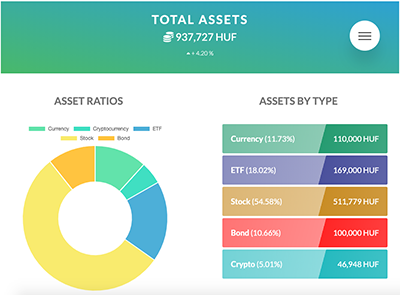
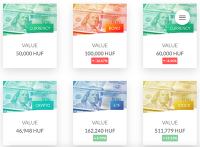
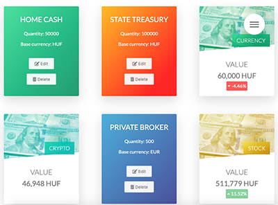
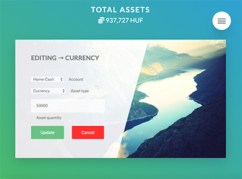
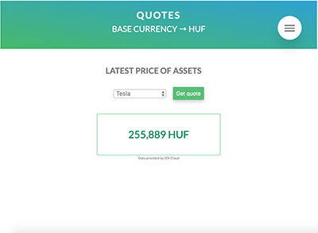

# Liquify

## Stack

- Framework: Vue.js with Vuex and VueCLI
- Libraries: Chart.js
- Style: CSS3 with Sass
- Database: Firestore
- API: IEX (using axios)

# Features

An application enabling registered users to track their savings and investments in one place.

## Register / Login view

Most of the features are only available after login. A new user can register with an e-mail and a password. After register/login the user is rerouted to the dashboard.

## Dashboard view (login required)

The dashboard gives an aggregated overlook of the user's assets including interactive charts and lists.

**Sections:**
- asset ratios (doughnut chart)
- assets by type (list showing assets grouped by their types)
- portfolio health (shows informations and warnings about the overall portfolio)

## Assets view (login required)

User's assets are listed here represented by individual asset cards. New assets can be added here.

**Asset card**

Holds information about the assets including account, base currency, quantity, price, type. Cards have different color codes for each asset type.

Cards can be flipped by clicking on them, showing further information and buttons for edit and delete.

- edit button: navigates to a form where some attributes of the asset can be changed.
- delete button: removes the asset from the database immediately.

## New asset / Edit asset view (login required)

A form enabling the user to create or edit an asset. After saving the modifications, it reroutes to the assets view.

## Quotes view

Displays the current price of a given stock selected from the dropdown field.

The price data is queried from IEX through API calls.

## Preferences view (login required)

Display currency of the app can be changed here.

**Important** => all the assets should be created with the same display currency setting as this value will be saved to the asset and calculations will be performed depending on it. This feature serves only display purposes.

## Screenshots

Example data created with test user for displaying purpose.

